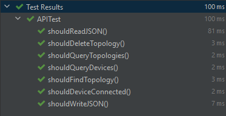

# Topology
Simple project to access, manage and store topologies with simple functionality

---

## Programming language (Java)
I chose Java because:
  * Java is easy to learn
  * Java is object-oriented
  * Java is platform-independent
  
---

## Code analysis
Used intellij inspect code to check for:
  * Styling warnings
  * Syntax warnings
  * Declaration warnings
  * Structure warnings

---

## Unit testing

