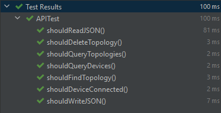

# Topology

Simple project to access, manage and store topologies with simple functionality

---

## Programming language (Java)

I chose Java because:
  * Java is easy to learn
  * Java is object-oriented
  * Java is platform-independent
  
---

## Code analysis

Used intellij inspect code to check for:
 1. Styling warnings
 2. Syntax warnings
 3. Declaration warnings
 4. Structure warnings

---

## Unit testing

---

## For JavaDoc

[Documentation](https://amrahmed11.github.io/Topology/JavaDoc/index.html)
